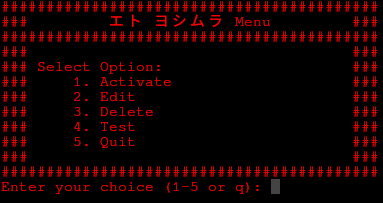

# Theme Changer v2

Welcome! This is a **work-in-progress CLI theme changer**.  
It is designed to manage themes for Kitty and potentially other applications, using the `./colors/` directory.

### Current Features
- **Change Kitty theme** using `.conf` files from the `./colors/` directory
- **Delete themes** from the theme directory
- **Find colors** in a file (test menu feature)

### Planned Features
- **Edit `color.conf`** — a configuration file that the program parses to generate the correct config files for each application
- **Change wallpaper**
- **Change Neovim/Vim theme**
- **Support for additional terminals** in the future

### Usage
Run the program in the terminal:

```bash
./main

